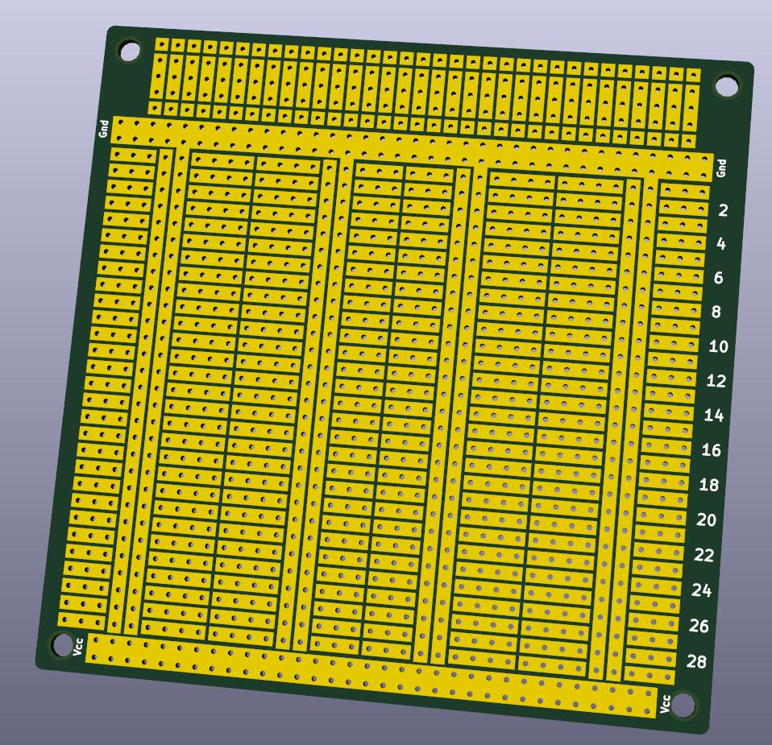
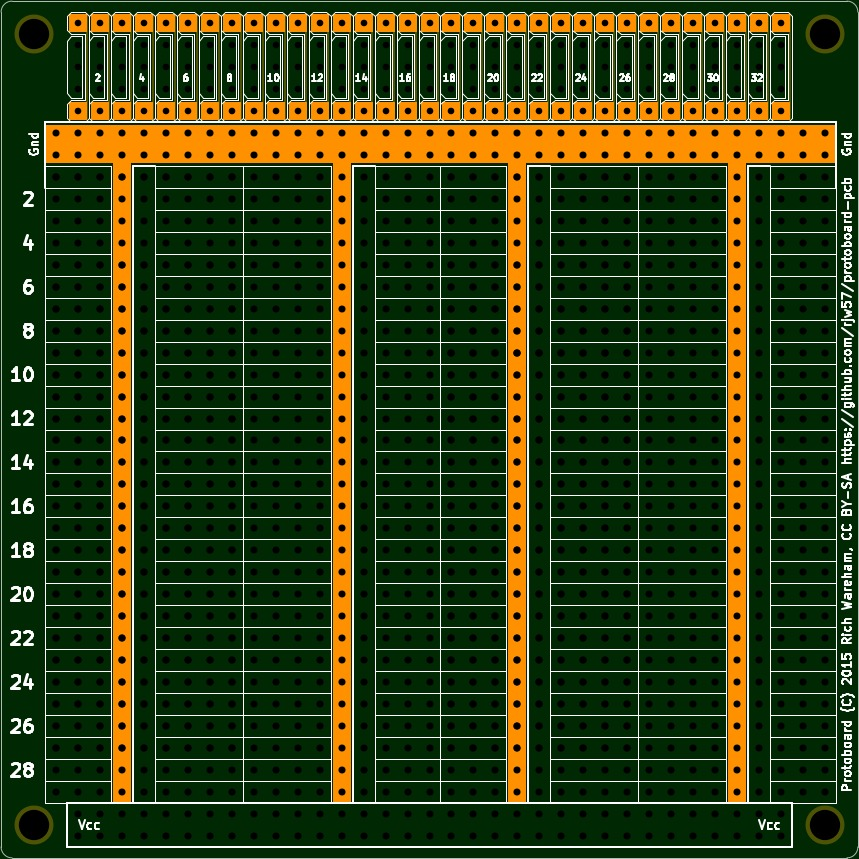
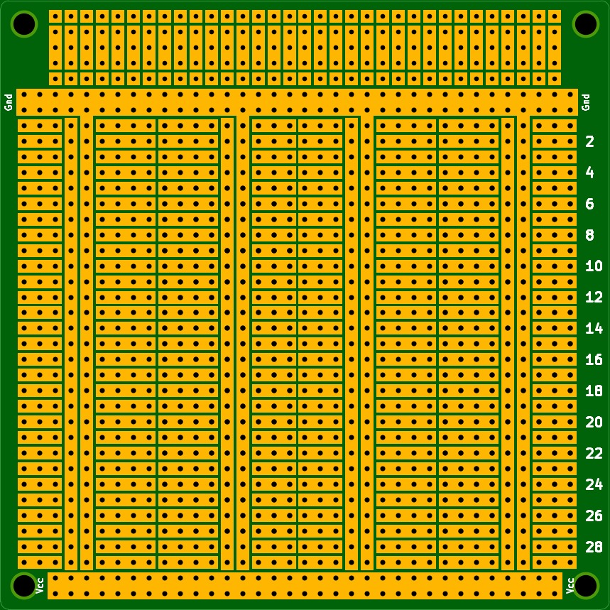

# Generic/universal prototype PCB

This is a PCB layout I made for prototyping projects after I was unsatisfied
with any of the layouts one could buy "off the shelf".

## Features

* Three columns of DIP-friendly stripboard layout.
* Supports 600mil and 300mil DIP packages.
* Integrated ground and power rails on each column.
* Each column may have different power supply.
* Top and bottom ground/power rails.
* Support for up to 33x2 external 0.1" pitch connections.

## Images

### 3D

### 2D

## Licence

This work is licensed under the [CC-BY-SA 2.0
UK](http://creativecommons.org/licenses/by-sa/2.0/uk/deed.en_GB) license.
